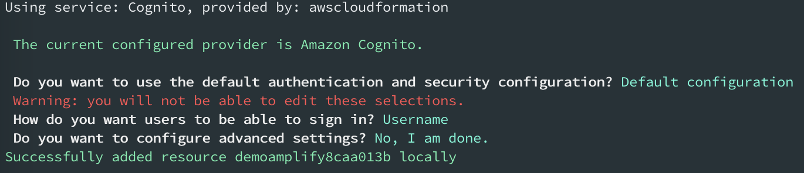
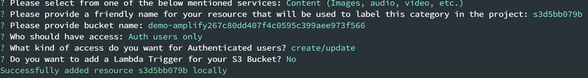
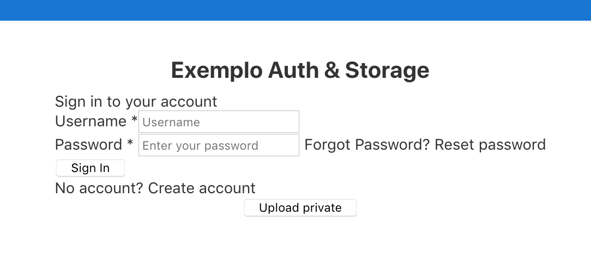

# AWS Amplify Angular Demo

Amplify environment demonstration


_Pre-requisites:_

- _AWS CLI_
- _Amplify CLI_
- _NodeJS_
- _Angular CLI_

## Getting Started

### Creating Repository and First Amplify Push

1. Create Amazon CodeCommit repository
2. Create IAM developer user with access to repository and needed AWS resources (E.g.: Amplify, S3, API Gateway, Lambda, etc.)
3. Create Amplify IAM user for the Amplify CLI and configure as AWS CLI profile
4. Clone the repository
   ```
   git clone your-codecommit-repository
   ```
5. Create a new Angular project
   ```
   cd your-codecommit-repository
   ng new demo-amplify --directory ./
   ```
6. Install Amplify dependecies
   ```
   npm install aws-amplify aws-amplify-angular
   ```
7. Init Angular project (this will be our Dev environment)
   ```
   amplify init
   ```
8. Create build file at the project root dir. You can find the file **amplify.yml** at **source/** folder
   ```
   version: 0.1
   backend:
   phases:
      build:
         commands:
         - '# Execute Amplify CLI with the helper script'
         - amplifyPush --simple
   frontend:
   phases:
      preBuild:
         commands:
         - npm ci
         - npm install -g @angular/cli
      build:
         commands:
         - ng build
   artifacts:
      baseDirectory: dist/demo-amplify
      files:
         - '**/*'
   cache:
      paths:
         - node_modules/**/*
   ```
9. Test build and serve before pushing the code _(if you find the error "Could not find plugin "proposal-numeric-separator"" try to install "@babel/compat-data": "~7.8.0", in devDependencies )_
   ```
   ng build
   ng serve
   ```
10. Push the first version
    ```
    git add .
    git commit -m "Initial commit"
    git push -u origin master
    amplify push
    ```
11. Go to the console https://console.aws.amazon.com/amplify/ and configure Frontend
12. Restrict access for the Amplify Dev endpoint
13. Enable email notification

### Creating Test Branch/Env

1. Create Test branch and initialize
   ```
   amplify env add
   git checkout -b test
   amplify env checkout test
   git push -u origin test
   amplify push
   git checkout master
   amplify env checkout dev
   git merge test
   git push
   amplify push
   ```
2. Go to the Amplify console and add the frontend environments with the respective branch
3. Restrict access for the Amplify Test endpoint
4. Enable email notification

### Adding Backend Resources and Merging Env

1. Go to the Dev env and branch
   ```
   git checkout dev
   amplify env checkout dev
   ```
2. Add authentication with Cognito

   ```
   amplify add auth
   ```

   

3. Add storage with S3

   ```
   amplify add storage
   ```

   

4. Push the backend
   ```
   amplify push
   git add .
   git commit -m "Backend resources"
   git push
   ```
5. Let's modify some files to add functionality for our app (you can find all the ref files at **source/** folder of this repository, just copy it to work)
   - When working with underlying aws-js-sdk, the “node” package should be included in types compiler option. Update your **src/tsconfig.app.json**
   - Import the configuration file and load it in **main.ts**
   - In your app module **src/app/app.module.ts** import the Amplify Module and Service
   - Modify your **src/index.html**, **src/app/app.component.ts** and **src/app/app.component.html**
6. Test local

   ```
   ng build
   ng serve
   ```

   

7. Push your new code
   ```
   git add .
   git commit -m "Added app func"
   git push
   ```
8. Now, let's merge the dev branch in test branch
   ```
   git checkout test
   amplify env checkout test
   git merge dev
   amplify push
   ```
9. Try to upload a file without Auth. After, create a user and try to upload again (Check the Web Console to verify the results)

## Multi Account Approach

Actually (02/05/2020), Amplify not supports multi-account approach utilizing CodeCommit, but, if would like to copy the project for another account you can replicate & sync the CodeCommit repository between accounts.

_Note: For other Git repositories you already can separate branch by account. For example, with GitHub._

## Developers Tips

1. Creating Amplify profile:
   ```
   aws configure --profile amplify
   ```
2. Cloning CodeCommit Repository using SSH:
   ```
    # Upload the public key in IAM - SSH keys for AWS CodeCommit;
    # Change the .ssh/config file
    # Host git-codecommit.*.amazonaws.com
    #    User <SSH key id>
    #    IdentityFile ~/.ssh/id_rsa
    # Clone the repository
    git clone codecommit:/v1/repos/<repository>
   ```
3. Sometimes when you run **amplify remove** some resources still in the account. Verify if the resource is deleted and if needed remove manually (E.g.: S3 Bucket);
4. Working with different environments:
   

## References

- AWS CLI: https://docs.aws.amazon.com/cli/latest/userguide/cli-chap-install.html
- Amplify CLI: https://aws-amplify.github.io/docs/cli-toolchain/quickstart
- Angular CLI: https://cli.angular.io/
- Amplify policy: https://aws-amplify.github.io/docs/cli-toolchain/usage?sdk=js#iam-policy-for-the-cli
- Getting Started Amplify + Angular: https://aws-amplify.github.io/docs/js/angular
- Workflow tips: https://read.acloud.guru/multiple-serverless-environments-with-aws-amplify-344759e1be08
- Limit pushes and merges to branches: https://docs.aws.amazon.com/codecommit/latest/userguide/how-to-conditional-branch.html
- Starting from existing project: https://aws.amazon.com/blogs/mobile/amplify-cli-adds-scaffolding-support-for-amplify-apps-and-authoring-plugins/
- Replicating CodeCommit repository: https://aws.amazon.com/blogs/devops/replicate-aws-codecommit-repository-between-regions-using-aws-fargate/
